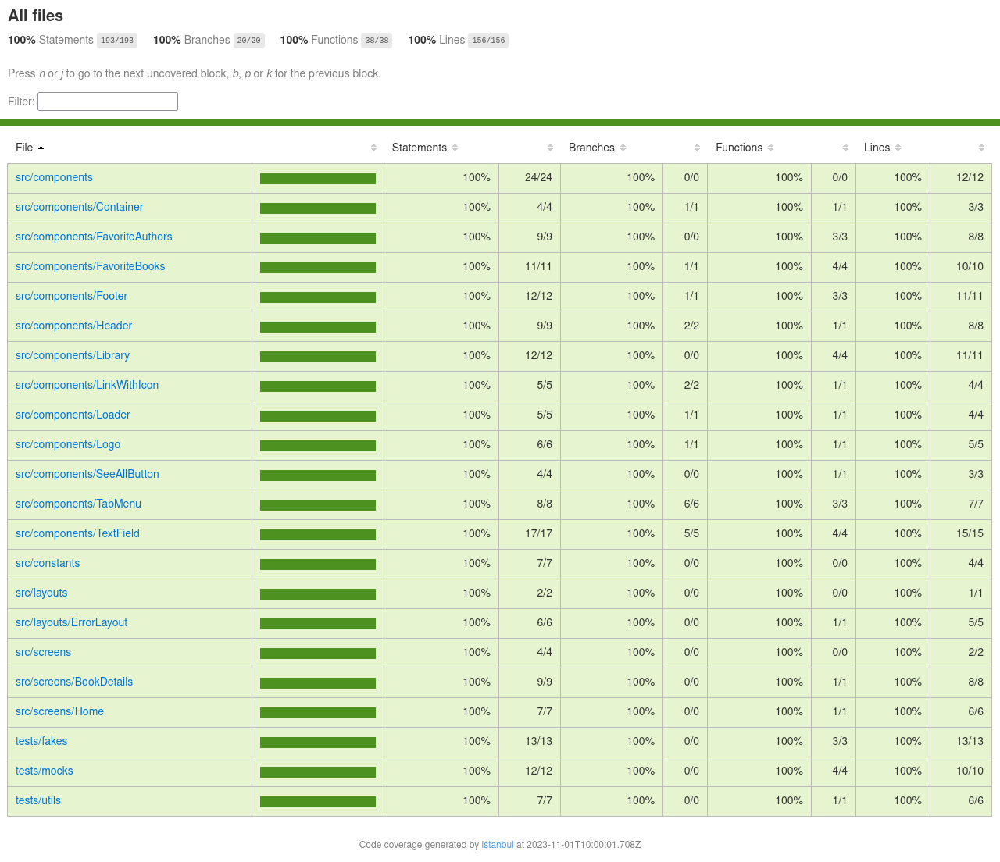

# SSBook

## About

- A app where the users can manage their books.

- An progressive web app made in React.js with Next.js and TypeScript.

## Getting Started

### Running the project in production (with Docker)

#### 1. Configure .env.production file

```.env.production
API_URL=PUT_URL_HERE
```

#### 2. Build image

```sh
docker build -t ssbook .
```

#### 3. Run container

```sh
docker run -d -p 3000:3000 --name ssbook ssbook
```

### Running the project in production (without Docker)

#### 1. Configure .env.production file

```.env.production
API_URL=PUT_URL_HERE
```

#### 2. Install dependencies

```sh
npm install
```

#### 3. Build

```sh
npm run build
```

#### 4. Start

```sh
npm start
```

### Running the project in development

#### 1. Configure .env.production file

```.env.production
API_URL=PUT_URL_HERE
```

#### 2. Install dependencies

```sh
npm install
```

#### 3. Run

```sh
npm run dev
```

### Testing the application

#### 1. Install dependencies

```sh
npm install
```

#### 2. Run

```sh
npm run test
```

## Metrics & Benchmarks

### Lighthouse

#### Desktop


#### Mobile


#### Test Coverage



## Technologies

- [React](https://react.dev/)
- [TypeScript](https://www.typescriptlang.org/)
- [Next.js](https://nextjs.org/)
- [SCSS](https://sass-lang.com/)
- [Apollo Client](https://www.apollographql.com/docs/)
- [GraphQL](https://graphql.org/)
- [ESLint](https://eslint.org/)
- [Prettier](https://prettier.io/)
- [Docker](https://docs.docker.com/)
- [Dockerfile](https://docs.docker.com/engine/reference/builder/)
- [React Spinners](https://www.davidhu.io/react-spinners/)
